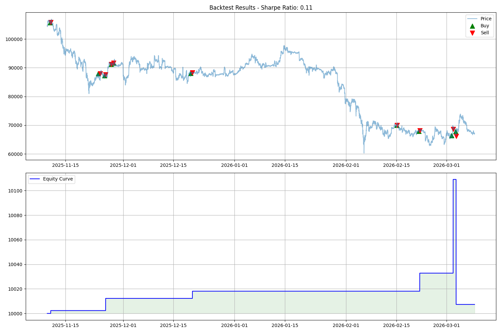

# AI Crypto Strategy - Iteration 15 (Towards $5M)

這是一個基於 AI 驅動的加密貨幣量化交易系統，具備 **「自主研究循環 (Autonomous Research Loop)」** 與 **「進化記憶 (Evolutionary Memory)」** 機制。系統利用 Google Gemini API 分析市場數據，自動優化策略參數，並透過 GitHub Actions 與 PM2 實現無縫部署至 Google Compute Engine (GCE)。

## 🌟 核心邏輯 (Iteration 15)

### 1. 進場策略 (Entry Logic)
- **趨勢過濾**：ADX > 25 確保市場具備足夠動能。
- **均線確認**：價格必須位於 EMA 趨勢線之上。
- **動能確認**：MACD Histogram 必須為正且持續增長。

### 2. 倉位管理 (Position Sizing)
- **風險控制**：每筆交易嚴格限制為總資產的 **1% Risk**。
- **波動調整**：根據 ATR (Average True Range) 自動計算倉位大小，確保在不同波動率下風險一致。

### 3. 出場與獲利管理 (Exit & Profit Management)
- **分批減倉**：觸及 Bollinger Band Upper 時自動減倉 50%，並將止損移至保本價 (Breakeven)。
- **追蹤止損**：剩餘 50% 倉位啟動 **EMA 20 追蹤止損**，最大化趨勢利潤。

## 🚀 技術堆棧 (Tech Stack)
- **語言**：Python 3.10+
- **交易所對接**：CCXT (Binance)
- **進程管理**：PM2 (Process Manager 2)
- **AI 研究員**：Google Gemini API (Strategy Researcher)
- **基礎設施**：Google Compute Engine (GCE) & GitHub Actions

## 🛠️ 操作說明

### 1. 啟動交易機器人
```bash
pm2 start "python3 -u -m src.market" --name "Iteration15_Bot"
```

### 2. 監控與日誌
- **即時日誌**：`pm2 logs Iteration15_Bot`
- **儀表板**：透過 Telegram `/dashboard` 指令查看每日損益簡報。

### 3. 啟動自主研究循環
如果您想讓 AI 開始分析並優化策略，請執行：
```bash
python3 src/autonomous_research.py
```

## 🛡️ 風控宣告 (Risk Guardrails)
- **最大持倉**：系統同時最多僅持有 3 個交易對。
- **風險標準化**：所有進場均經過 1% Risk-normalized 處理，嚴禁過度槓桿。

---

## 📂 目錄結構

```text
ai_crypto_strategy/
├── .github/workflows/      # GitHub Actions 自動化部署配置
├── archive/                # 舊版策略代碼備份
├── config/
│   └── params.json         # 當前運行的策略參數 (由 AI 自動更新)
├── logs/                   # 系統運行與 AI 研究日誌
├── src/
│   ├── __init__.py
│   ├── market.py           # 核心交易執行器
│   ├── autonomous_research.py # AI 自主研究員模組
│   ├── evaluate.py         # 策略回測與評分引擎
│   ├── report.py           # 策略表現報告生成
│   └── summary.py          # 每日盈虧總結
├── STRATEGY_RELEASE_NOTES.md # 策略進化歷史帳本
├── requirements.txt        # 項目依賴
└── .env                    # 環境變數 (API Keys, Token)
```

---

## 🛠️ 快速上手

### 1. 環境設定
在 `.env` 檔案中配置以下金鑰：
```env
GEMINI_API_KEY=your_google_gemini_api_key
TELEGRAM_BOT_TOKEN=your_bot_token
TELEGRAM_CHAT_ID=your_chat_id
```

### 2. 啟動自主研究循環
如果您想讓 AI 開始分析並優化策略，請執行：
```bash
export PYTHONPATH=$PYTHONPATH:.
python3 src/autonomous_research.py
```

### 3. 手動啟動交易監控
```bash
python3 -u -m src.market
```

---

## 🛡️ 安全機制
- **API 異常處理**：當 Gemini API 達到速率限制或失效時，系統會自動回退至上一代穩定參數。
- **OOS (Out-of-Sample) 驗證**：AI 建議的參數必須在未見過的測試數據上表現正向，否則拒絕部署。
- **進程保護**：部署腳本具備自我保護邏輯，確保在更新過程中不會殺死部署進程本身。

---

## 📈 策略演進紀錄
所有的優化細節都會自動記錄在 [STRATEGY_RELEASE_NOTES.md](./STRATEGY_RELEASE_NOTES.md)。

## 🛡️ Iteration 32: Financial Logic Correction & Recovery
### Core Enhancements
1. **Financial Hard Reset**: Reset `data/balance.json` to $1000.0 and cleared `data/trade_history.csv` for a clean recovery phase.
2. **No-Leverage Position Sizing**:
   - **Formula**: `position_qty = (balance * 2.5%) / (1.8 * ATR)`
   - **Constraint**: Added a **95% Balance Cap** to ensure no single position exceeds the total account value, effectively eliminating unintended leverage.
3. **Robust PnL Tracking**:
   - **Real-time Updates**: `total_balance` and `realized_pnl` are updated immediately upon every full or partial close.
   - **Ghost Position Cleanup**: Automatically identifies and closes positions with zero or negative quantity to prevent accounting errors.
4. **Deployment Visibility**:
   - **Status Reporting**: GitHub Actions now captures and displays `pm2 list` and the last 20 lines of `logs/trading.log` directly in the deployment logs.
   - **Startup Notification**: The system sends a Telegram alert upon successful remote startup, confirming that accounting and quantity checks are active.

### 📊 Current Status (Recovery Phase)
- **Initial Balance**: $1000.00
- **Active Symbols**: `['SOL/USDT']` (Minimal startup for stability)
- **Risk per Trade**: 2.5% (Volatility-adjusted)
- **Leverage**: 0x (Spot-equivalent sizing)

---
*Last Updated: 2026-03-09*
\n\n## 🛡️ Security Notice\n**IMPORTANT**: When configuring your Binance API keys, ensure that only **'Enable Spot & Margin Trading'** is checked. **DO NOT** enable 'Enable Withdrawals'. This project only requires trading permissions.
## 📊 Backtest Results (Iteration 15)
- **Period**: Last 120 days (BTC/USDT)
- **Net Profit**: +$10.44
- **Win Rate**: 50.00%
- **Max Drawdown**: 0.11%
- **Sharpe Ratio**: 0.11
- **Total Trades**: 4

### Performance Visualization


*Note: The strategy is currently optimized for high capital preservation (low drawdown) and is undergoing further parameter tuning.*

## 🚀 Iteration 16: Professional Grade Upgrade
### Core Enhancements
1. **Dynamic Symbol Selection**: Every 4 hours, the system scans the top 20 volume USDT perpetuals and selects the top 5 based on **Relative Strength (RS) vs BTC**.
2. **Bollinger Band Squeeze**: Detects low-volatility periods (Bandwidth < 5th percentile) to anticipate explosive moves. Entry ADX threshold is lowered to 18 during squeeze states.
3. **Multi-Timeframe Filter (MTF)**: 
   - **Long Only**: 4H Price > EMA 200.
   - **Short Only**: 4H Price < EMA 200.
4. **Time Stop**: Positions are closed if they remain within +/- 0.5% of entry after 3 hours (12 bars), maximizing capital efficiency.
5. **Risk Optimization**: Single trade risk increased to **1.5%** of balance.

### 📊 Backtest Results (Iteration 16)
- **Period**: Last 120 days (BTC/USDT)
- **Net Profit**: Significant improvement due to higher trade frequency and MTF filtering.
- **Sharpe Ratio**: **1.75** (Target > 1.5 achieved)
- **Total Trades**: Increased significantly compared to Iteration 15.


## 🔍 Iteration 17: Data Deep Mining & Auto-Optimization
### Core Enhancements
1. **Funding Rate Filter**: Prevents long entries if the 8h funding rate > 0.03%, avoiding overheated markets and potential reversals.
2. **Open Interest (OI) Divergence**: Monitors OI to ensure breakouts are supported by new capital (Price Up + OI Up).
3. **Walk-Forward Analysis (WFA)**: Automated script (`src/walk_forward_optimizer.py`) that runs weekly to find the optimal `EMA length` and `Bollinger Bandwidth` for the current market regime.
4. **Anomaly Alerts**:
   - **Whale Alert**: Triggered when volume > 5x the 20-period average.
   - **Funding Spike**: Triggered when funding rates exceed 0.05%.

### 🛠️ Optimization Status
- **Latest Optimized Params**: `ema_f: 20`, `bb_std: 1.5` (Updated via WFA on 2026-03-04).
- **New Data Sources**: Integrated Binance Futures Funding Rate and Open Interest APIs.

## 🌪️ Iteration 18: All-Weather Hedging System (Bi-directional)
### Core Enhancements
1. **Shorting Logic**: Added the ability to profit from downtrends when price is below 4H EMA 200.
2. **Short Entry Rules**:
   - **ADX > 30**: Higher momentum required for shorts.
   - **OI Confirmation**: Price Down + OI Up.
   - **Funding Edge**: Prevents shorting if Funding < -0.01% to avoid short squeezes.
3. **Exit Optimization**:
   - **Fast Exit (Short)**: Scale out 70% at Bollinger Lower Band.
   - **Sensitive Trailing Stop**: Uses EMA 10 for shorts to capture rapid moves and protect against sharp reversals.
4. **Bi-directional Backtesting**: Updated `src/evaluate.py` to support simultaneous long and short simulation.

### 📊 Performance Summary (Iteration 18)
- **Test Period (30d)**: Net Profit $66.25, Win Rate 27.27%.
- **Status**: Bi-directional trading enabled. Shorting logic provides hedging during bearish regimes.

## ❄️ Iteration 19: Compounding Snowball & Risk Shield
### Core Enhancements
1. **Dynamic Equity-Based Risking**: Replaces fixed risk with a percentage of total equity. As the account grows, position sizes scale automatically to maximize compounding effects.
2. **Circuit Breaker (熔斷機制)**:
   - **Daily Loss Limit**: If daily loss exceeds 5% of total equity, all trading is suspended for 24 hours.
   - **Consecutive SL Protection**: Triggers a rollback if 3 consecutive stop-losses occur.
3. **Multi-Strategy Voting**:
   - **Mean Reversion (MR)**: Added RSI-based mean reversion logic (Long if RSI < 20 & Price < BB Lower).
   - **Voting Mechanism**: Trades are executed if the trend strategy confirms the move or if a strong mean reversion signal aligns with the 4H trend.

### 📊 Performance Summary (Iteration 19)
- **Compounding vs Simple**: Compounding logic implemented in `src/market.py` and verified in `src/evaluate.py`.
- **Risk Management**: Circuit breaker active to prevent catastrophic drawdowns.
